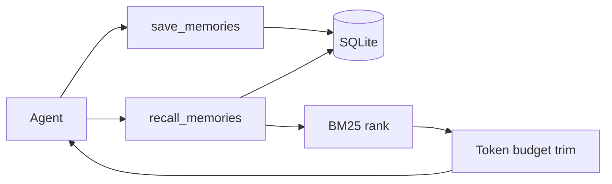

# TinyContext

<!-- mcp-name: io.github.TinySuiteHQ/tinycontext -->

**Context that fits your local LLMs.**

[](https://pypi.org/project/tinysuite-context/)
[](LICENSE)
[](https://github.com/TinySuiteHQ/TinyContext/releases)
[](https://hub.docker.com/r/marcellm01/tinycontext)


TinyContext is a token-light local memory layer for AI agents. It stores concise
memories in SQLite, ranks them against the current task, and returns only the
context that fits the requested token budget.

No hosted account. No giant context dumps. No required vector database.

## Choose a tier

| Tier | Use it when | Entry point |
| --- | --- | --- |
| Python library | You are building an agent or Python application | `pip install tinysuite-context` |
| One-command MCP | An MCP client should launch TinyContext for you | `uvx --python 3.12 --from "tinysuite-context[server]" tinycontext` |
| Docker | You want persistent self-hosted storage and HTTP MCP | `docker compose ... up -d` |

The Python library contains the memory engine. MCP, FastAPI, and Docker are
adapters around the same `save_memories` and `recall_memories` operations.

## One-command MCP

Add TinyContext to any stdio MCP client:

```json
{
  "mcpServers": {
    "tinycontext": {
      "command": "uvx",
      "args": [
        "--python",
        "3.12",
        "--from",
        "tinysuite-context[server]",
        "tinycontext"
      ]
    }
  }
}
```

The no-argument `tinycontext` command runs stdio MCP. The database is created
lazily in TinyContext's per-user data directory on the first save or recall.

Check the resolved configuration and storage readiness with:

```bash
uvx --python 3.12 --from "tinysuite-context[server]" tinycontext doctor
```

TinyContext exposes two tools:

```text
save_memories(memories, session_id?)
recall_memories(query, session_id?, max_tokens?, top_k?)
```

- Use `save_memories` for durable facts, preferences, decisions, and research notes.
- Use `recall_memories` before answering when previous context may help.
- Keep `max_tokens` small enough that recalled memory earns its place in the prompt.

## Python library

Install only the transport-independent core:

```bash
pip install tinysuite-context
```

```python
from pathlib import Path

from tinycontext import (
    MemoryInput,
    TinyContextConfig,
    recall_memories,
    save_memories,
)

config = TinyContextConfig(
    memory_db_path=str(Path("agent-memory.db").resolve()),
    recall_max_tokens=800,
)

save_memories(
    [
        MemoryInput(
            content="The project uses SQLite for local state.",
            tags=["architecture"],
            metadata={"source": "design-session"},
        )
    ],
    session_id="project-a",
    config=config,
)

result = recall_memories(
    "How does the project store state?",
    session_id="project-a",
    config=config,
)

for memory in result["memories"]:
    print(memory["content"])
```

Programmatic configuration does not read environment variables or depend on the
checkout. Passing no config uses the per-user data directory returned by
`platformdirs`.

## Docker

Run the published image as an MCP server over Streamable HTTP:

```bash
docker compose -f "https://github.com/TinySuiteHQ/TinyContext.git#main:compose.quickstart.yaml" up -d
```

Connect an MCP client to:

```json
{
  "mcpServers": {
    "tinycontext": {
      "url": "http://localhost:8000/mcp"
    }
  }
}
```

The `data` volume persists `/data/memories.db`.

Stop the service with:

```bash
docker compose -f "https://github.com/TinySuiteHQ/TinyContext.git#main:compose.quickstart.yaml" down
```

For a local image build:

```bash
docker compose up -d --build
```

The optional FastAPI profile uses the same image:

```bash
docker compose --profile fastapi up -d --build
```

- MCP Streamable HTTP: `http://localhost:8000/mcp`
- FastAPI: `http://localhost:8001`

## How recall works



1. Save concise memory records as text with optional tags and metadata.
2. Filter by `session_id` when a session scope is supplied.
3. Rank candidates against the query with BM25.
4. Return the highest-ranked memories within the token budget.

## FastAPI

The optional HTTP API mirrors the two MCP tools.

| Method | Path | Purpose |
| --- | --- | --- |
| GET | `/health` | Liveness |
| POST/GET | `/save_memories` | Persist one or more memories |
| POST/GET | `/recall_memories` | Recall ranked memories within a token budget |

Install and run it directly:

```bash
pip install "tinysuite-context[server]"
uvicorn tinycontext.servers.fastapi_server:app --host 0.0.0.0 --port 8000
```

### Save request

```json
{
  "session_id": "optional-session",
  "memories": [
    {
      "content": "User prefers concise answers",
      "tags": ["preference"],
      "metadata": {"source": "chat"}
    }
  ]
}
```

### Recall request

```json
{
  "query": "user preferences",
  "session_id": "optional-session",
  "max_tokens": 2000,
  "top_k": 10
}
```

### Error codes

| Code | HTTP | Meaning |
| --- | --- | --- |
| `empty_memory` | 400 | Missing or blank memory content/query |
| `session_not_found` | 404 | No memories exist for the requested session |
| `recall_budget` | 400 | Invalid recall budget parameters |
| `internal_error` | 500 | Unexpected server error |

## Configuration

The core defaults are:

| Key | Default | Description |
| --- | --- | --- |
| `memory_db_path` | Per-user TinyContext data directory | SQLite database |
| `recall_top_k` | `10` | Maximum memories considered |
| `recall_max_tokens` | `2000` | Default recall token budget |
| `encoding_name` | `o200k_base` | Tokenizer used for budgeting |

Server processes look for `context_config.json` in the per-user TinyContext
configuration directory. A relative `memory_db_path` inside a JSON config is
resolved relative to that file.

Environment overrides:

| Variable | Purpose |
| --- | --- |
| `TINYCONTEXT_CONFIG_PATH` | Use an explicit JSON configuration file |
| `TINYCONTEXT_MEMORY_DB_PATH` | Override the SQLite database path |
| `TINYCONTEXT_RECALL_TOP_K` | Override the default candidate count |
| `TINYCONTEXT_RECALL_MAX_TOKENS` | Override the default token budget |
| `TINYCONTEXT_ENCODING_NAME` | Override the tokenizer |
| `TINYCONTEXT_VERSION` | Set the FastAPI/container version |
| `MCP_TRANSPORT` | `stdio`, `sse`, or `streamable-http` |
| `MCP_HOST` | MCP HTTP bind host |
| `MCP_PORT` | MCP HTTP bind port |
| `MCP_CORS_ORIGINS` | Comma-separated CORS origins |

An existing checkout-local database remains usable:

```bash
TINYCONTEXT_MEMORY_DB_PATH=/absolute/path/to/TinyContext/data/memories.db tinycontext
```

## Development

```bash
git clone https://github.com/TinySuiteHQ/TinyContext
cd TinyContext
python -m venv .venv
source .venv/bin/activate
pip install -e ".[server]"
python -m unittest discover tests
python scripts/smoke_mcp_stdio.py
```

TinyContext supports Python 3.12 and newer. CI tests Python 3.12, 3.13, and
3.14 across Linux, macOS, and Windows.

Source-checkout compatibility shims remain available:

```bash
python servers/mcp_server.py
uvicorn servers.fastapi_server:app --host 0.0.0.0 --port 8000
```

## Entrypoints

- `tinycontext.save_memories` and `tinycontext.recall_memories`: Python API
- `tinycontext` / `tinycontext mcp`: stdio MCP
- `tinycontext serve`: Streamable HTTP MCP
- `tinycontext doctor`: configuration and storage readiness
- `tinycontext.servers.fastapi_server:app`: optional FastAPI application

## License

MIT. See [LICENSE](LICENSE) and [NOTICE](NOTICE).
